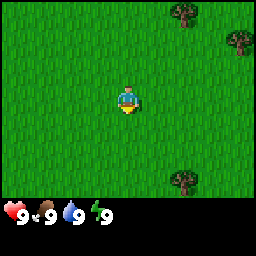
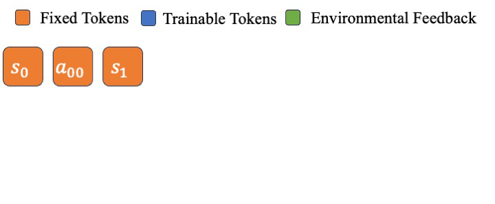

<script src="https://polyfill.io/v3/polyfill.min.js?features=es6"></script>
<script id="MathJax-script" async src="https://cdn.jsdelivr.net/npm/mathjax@3/es5/tex-mml-chtml.js"></script>

<div style="display: flex; justify-content: center; align-items: center; flex-wrap: wrap; gap: 24px; width: 100%;">
  <a href="https://github.com/WentseChen/Verlog" target="_blank" style="text-decoration: none; display: flex; align-items: center;">
    
    <span style="vertical-align: middle; font-size: 16px; margin-left: 6px;">Source Code</span>
  </a>

  <a href="https://wandb.ai/cwz19/verlog?nw=nwusercwz19" target="_blank" style="text-decoration: none; display: flex; align-items: center;">
    
    <span style="vertical-align: middle; font-size: 16px; margin-left: 6px;">Experiment Logs</span>
  </a>
</div>

Verlog is a well-tuned multi-turn RL framework built for long-horizon LLM agentic tasks. It extends [VeRL](https://github.com/volcengine/verl) and [BALROG](https://github.com/balrog-ai/BALROG), and follows the core design principles of [pytorch-a2c-ppo-acktr-gail](https://github.com/ikostrikov/pytorch-a2c-ppo-acktr-gail), while introducing tailored modifications for efficient multi-turn training.

## Key features:  

🧠 Turn-Level Abstraction: To handle extremely long episodes, we treat each turn as an independent training sample. This eliminates the need to encode the entire trajectory into a single context window and allows for modular, customizable memory architectures.

🎯 Fixed-Turn Batching: To address the high variance in episode lengths across environments, we use fixed-turn batching. Each training batch contains a fixed number of turns. For incomplete episodes, we replace final rewards with value function estimates as the supervision signal.

🛠️ Tailored for Multi-Turn RL: To address the unique challenges of multi-turn RL, we introduce a set of targeted techniques such as Dual Discounting GAE and Critic Pre-training, combined with carefully tuned hyperparameters to ensure efficient and stable learning.

📊 Validated Across Challenging Environments: Our approach has been empirically validated on diverse environments characterized by long horizons and high episode length variance, including BabyAI, BabaIsAI, and Crafter. It consistently demonstrates stable learning dynamics and strong performance out of the box. For instance, in Crafter, episode lengths range from 70 to 400 steps, with an average around 190.

## Main Results

* Crafter Results:

  <div style="display: flex; justify-content: space-between; align-items: flex-start; width: 100%; flex-wrap: nowrap;">
    <figure style="flex: 1; text-align: center; margin: 0 10px 20px 10px;">
      
      <figcaption style="margin: 0; padding: 0; font-size: 14px; line-height: 1;">Zero-shot policy</figcaption>
    </figure>
    <figure style="flex: 1; text-align: center; margin: 0 10px 20px 10px;">
      
      <figcaption style="margin: 0; padding: 0; font-size: 14px; line-height: 1;">Fine-tuned policy</figcaption>
    </figure>
  </div>
  
  <div style="overflow-x: auto;">
    <table style="width: 100% !important; min-width: 300px !important; border-collapse: collapse !important; font-family: sans-serif !important;">
        <thead>
            <tr>
                <th style="padding: 8px !important; text-align: center !important; white-space: nowrap !important; border-bottom: 2px solid #cccccc !important; background-color: #cccccc !important; color: #000 !important;">Metric</th>
                <th style="padding: 8px !important; text-align: center !important; white-space: nowrap !important; border-bottom: 2px solid #cccccc !important; background-color: #cccccc !important; color: #000 !important;">Instruct-model</th>
                <th style="padding: 8px !important; text-align: center !important; white-space: nowrap !important; border-bottom: 2px solid #cccccc !important; background-color: #cccccc !important; color: #000 !important;">Verlog (Ours)</th>
            </tr>
        </thead>
        <tbody>
            <tr>
                <td style="padding: 8px !important; text-align: center !important; white-space: nowrap !important; border-bottom: 1px solid #cccccc !important;">Rewards</td>
                <td style="padding: 8px !important; text-align: center !important; white-space: nowrap !important; border-bottom: 1px solid #cccccc !important;">5.80</td>
                <td style="padding: 8px !important; text-align: center !important; white-space: nowrap !important; border-bottom: 1px solid #cccccc !important; font-weight: bold !important;">10.44</td>
            </tr>
            <tr>
                <td style="padding: 8px !important; text-align: center !important; white-space: nowrap !important;">Trajectory Length</td>
                <td style="padding: 8px !important; text-align: center !important; white-space: nowrap !important;">172.23</td>
                <td style="padding: 8px !important; text-align: center !important; white-space: nowrap !important; font-weight: bold !important;">196.42</td>
            </tr>
        </tbody>
    </table>
  </div>


    > Crafter's experiments are done with Qwen2.5-7B-Instruct model, using PPO algorithm, trained on 8xH100 GPUs with 82Gb memory for ~36 hours, corresponding to 170 PPO updates.


* BabaIsAI Results (win rate)

    goto_win → 🏁; 
    distr_obj → 🎁; 
    two_room → 🚪; 
    distr_obj_rule → 📏;  
    maybe_break_stop → ⚠️;

  <div style="overflow-x: auto;">
      <table style="width: 100%; border-collapse: collapse; text-align: center; font-family: sans-serif;">
          <thead>
              <tr>
                  <th style="padding: 10px; border-bottom: 2px solid #ddd; background-color: #cccccc !important; color: #000;">Model</th>
                  <th style="padding: 10px; border-bottom: 2px solid #ddd; background-color: #cccccc !important; color: #000;">🏁+🎁</th>
                  <th style="padding: 10px; border-bottom: 2px solid #ddd; background-color: #cccccc !important; color: #000;">🚪+🏁</th>
                  <th style="padding: 10px; border-bottom: 2px solid #ddd; background-color: #cccccc !important; color: #000;">🚪+🏁+📏</th>
                  <th style="padding: 10px; border-bottom: 2px solid #ddd; background-color: #cccccc !important; color: #000;">🚪+⚠️+🏁</th>
              </tr>
          </thead>
          <tbody>
              <tr>
                  <td style="padding: 10px; border-bottom: 1px solid #ddd;">Instruct-model</td>
                  <td style="padding: 10px; border-bottom: 1px solid #ddd;">0.66 &plusmn; 0.08</td>
                  <td style="padding: 10px; border-bottom: 1px solid #ddd;">0.03 &plusmn; 0.03</td>
                  <td style="padding: 10px; border-bottom: 1px solid #ddd;">0.22 &plusmn; 0.07</td>
                  <td style="padding: 10px; border-bottom: 1px solid #ddd;">0.19 &plusmn; 0.07</td>
              </tr>
              <tr>
                  <td style="padding: 10px; border-bottom: 1px solid #ddd; font-weight: bold;">Verlog (Ours)</td>
                  <td style="padding: 10px; border-bottom: 1px solid #ddd; font-weight: bold;">1.00 &plusmn; 0.00</td>
                  <td style="padding: 10px; border-bottom: 1px solid #ddd; font-weight: bold;">1.0</td>
                  <td style="padding: 10px; border-bottom: 1px solid #ddd; font-weight: bold;">0.89 &plusmn; 0.11</td>
                  <td style="padding: 10px; border-bottom: 1px solid #ddd; font-weight: bold;">0.69</td>
              </tr>
          </tbody>
      </table>
  </div>
  

  > BabaIsAI's experiments are done with Qwen2.5-3B-Instruct model, using PPO algorithm, trained on 4xA40 GPUs with 48Gb memory for ~24 hours, corresponding to 300 PPO updates.


* BabyAI Results (win rate)
  <div style="overflow-x: auto;">
    <table style="width: 100%; border-collapse: collapse; text-align: center; font-family: sans-serif;">
        <thead>
            <tr>
                <th style="padding: 10px; border-bottom: 2px solid #ddd; background-color: #cccccc !important; color: #000;">Model</th>
                <th style="padding: 10px; border-bottom: 2px solid #ddd; background-color: #cccccc !important; color: #000;">goto</th>
                <th style="padding: 10px; border-bottom: 2px solid #ddd; background-color: #cccccc !important; color: #000;">pickup</th>
                <th style="padding: 10px; border-bottom: 2px solid #ddd; background-color: #cccccc !important; color: #000;">pick_up_seq_go_to</th>
                <th style="padding: 10px; border-bottom: 2px solid #ddd; background-color: #cccccc !important; color: #000;">open</th>
            </tr>
        </thead>
        <tbody>
            <tr>
                <td style="padding: 10px; border-bottom: 1px solid #ddd;">Instruct-model</td>
                <td style="padding: 10px; border-bottom: 1px solid #ddd;">0.88 &plusmn; 0.06</td>
                <td style="padding: 10px; border-bottom: 1px solid #ddd;">0.41 &plusmn; 0.09</td>
                <td style="padding: 10px; border-bottom: 1px solid #ddd;">0.22 &plusmn; 0.07</td>
                <td style="padding: 10px; border-bottom: 1px solid #ddd;">0.09 &plusmn; 0.05</td>
            </tr>
            <tr>
                <td style="padding: 10px; border-bottom: 1px solid #ddd; font-weight: bold;">Verlog (Ours)</td>
                <td style="padding: 10px; border-bottom: 1px solid #ddd; font-weight: bold;">1.00 &plusmn; 0.00</td>
                <td style="padding: 10px; border-bottom: 1px solid #ddd; font-weight: bold;">1.00 &plusmn; 0.00</td>
                <td style="padding: 10px; border-bottom: 1px solid #ddd; font-weight: bold;">0.65 &plusmn; 0.16</td>
                <td style="padding: 10px; border-bottom: 1px solid #ddd; font-weight: bold;">0.94 &plusmn; 0.07</td>
            </tr>
        </tbody>
    </table>
  </div>

    > BabyAI's experiments are done with Qwen2.5-3B-Instruct model, using PPO algorithm, trained on 4xA40 GPUs with 48Gb memory for ~24 hours, corresponding to 300 PPO updates.

## Technical Report

In the following sections, we outline our design choices, implementation details, and explore potential research questions that our framework may help address.

### Model & Prompt

* **Instruct Model:**

    We begin with the Instruct variant of Qwen-2.5 (Qwen-2.5-3B/7B-Instruct), rather than the base model, for two key reasons. First, it enables seamless integration with [BALROG](https://github.com/balrog-ai/BALROG), a framework designed to evaluate the zero-shot performance of instruct models across a range of benchmarks. Second, it allows us to use the benchmark's prompts with minimal modifications

* **Memory Mechanism:**
    Rather than placing the entire trajectory into the context window, we include only the latest $$n+1$$ turns. Each turn, i.e., data = $$(\text{history}_t, s_t,$$ $$\text{think}_t, a_t)$$ , with $$\text{history}_t = \{s_{t-n},$$ $$\text{think}_{t-n}, a_{t-n},$$ $$..., s_{t-1},$$ $$\text{think}_{t-1}, a_{t-1}\}$$, is treated as an individual training data point. As a result, each training batch consists of `batch_size` individual turns, not `batch_size` full trajectories.

  The results show that for the 3B Qwen model, performance peaks at $$n = 1$$ or $$2$$ and degrades as $$n$$ increases to $$4$$ or $$8$$. We hypothesize that this decline is due to the 3B model’s limited capacity to handle long contexts—for example, $$n = 8$$ yields a prompt of approximately 4.6k tokens. Whether this trend holds for larger models is an open question. Notably, the tasks we evaluate can be framed as Markov Decision Processes (MDPs). In more complex or partially observable tasks, a larger $$n$$ may help.

  We observed two notable issues related to the multi-turn memory mechanism:

    * **Mimicking prior reasoning patterns:** The model tends to replicate reasoning styles from earlier turns, reducing the diversity of its thought processes.
  
    * **Multi-turn hallucinations:** The model struggles to distinguish between actions imagined during reasoning and actual events in the environment. For example, it may plan to "chop a tree then craft a pickaxe" but fail to find a tree in reality—yet still act as if the plan succeeded. This is a unique challenge for agentic tasks.
 
  We conducted preliminary experiments to address these issues: (1) We tested a variant that includes only the final action in history: data = $$(\text{history}_t, s_t, \text{think}_t, a_t)$$, with $$\text{history}_t = \{s_{t-n}, a_{t-n}, ..., s_{t-1}, a_{t-1}\}$$. (2) We tested a variant that periodically clears the history buffer (every 5 steps). Both approaches led to worse performance.

* **Prompt Template:**
    Belows is the prompt template used for BabyAI. The prompts are adapted from [BALROG](https://github.com/balrog-ai/BALROG).
    ```
    [SYSTEM] You are an agent playing a simple navigation game. Your goal is to {MISSION}. The following are the possible actions you can take in the game, followed by a short description of each action: {AVAILABLE ACTIONS}. In a moment I will present you an observation. Tips: {TIPS}. PLAY!
    ```
    ```
    [USER] {OBSERVATION}
    ```
    ```
    [ASSISTANT] THINK: {THINK} ACTION: {ACTION}
    ```
    ```
    [USER] {OBSERVATION}. What will you do next? Please respond in the following format: THINK: step-by-step reasoning. ACTION: One valid action from the allowed set.
    ```
    We recommend always examining the model’s zero-shot outputs before training. Specifically, evaluate: (1) Whether reasoning paths are diverse, (2) whether the model reasons sufficiently before selecting an action, (3) the ratio of valid actions, and (4) the types of failure cases. These checks ensure the model understands the environment from the prompt. If not, revise the prompt before fine-tuning.

### Environment

Verlog uses a highly abstract game as its testbed, reducing the need for prompt engineering and allowing researchers to focus on algorithmic design. We detail all engineering aspects below:

* **Valid Action:**
   Improving the valid action ratio through prompt engineering is the simplest and most effective way to boost performance. In our setup, we ensure the model produces valid actions over 95% of the time using the following strategies:

  * Hardcoded action translation: Certain invalid actions are frequently produced by zero-shot LLMs (e.g., "Move forward" and "Go forward"). We implement a hand-crafted translation function to map these to valid actions, preventing them from lowering the valid action ratio.
  
  * Replace invalid actions with a default action: When the LLM outputs an invalid action, the environment rejects it and executes a predefined default action instead. Simultaneously, we replace the invalid action with the default one before appending it to the history buffer. This prevents the agent from mimicking the invalid action in subsequent steps.
    
  We observe that truncating the trajectory upon encountering an invalid action leads to worse performance. Replacing invalid actions with a default action yields better results. In this work, we apply a 0.1 penalty to invalid actions. However, with a high valid action ratio, the format penalty has minimal impact on overall performance.

* **Reward:**
    Rewards are rule-based and provided by the environment. In BabyAI and BabaIsAI, we adopt a binary trajectory-level reward scheme: 1 for success trajectory, 0 for failure trajectory. Combined with dual-discount GAE, this setup ensures that earlier steps in suboptimal trajectories receive lower credit compared to those in optimal ones. For Crafter, we use the native environment rewards directly.

* **Batch Environment (Fixed-Turn Batching):**
    Our framework supports asynchronous rollouts and works with any environment using the OpenAI Gym interface. Each training batch size is: `n_env` × `e_len`, where:
    * `n_env` = number of parallel environments
    * `e_len` = episode length per rollout

    Note: `e_len` can be smaller than the environment's trajectory length. For example, we set `e_len = 8` and max trajectory length = 128 in BabyAI. For early truncated trajectories, we leverage the value function to guide the training process. A longer `e_len` (smaller `n_env`) often leads to better performance, albeit at the cost of lower token throughput.
    

### Algorithm

* **Dual Discounting GAE:**

    <div style="width: 100%;">
      
    </div>
    
    To incentivize agents to solve tasks with fewer environment steps, we decouple token-level discounting $$(\gamma_{\text{token}}, \lambda_{\text{token}})$$ and step-level $$(\gamma_{\text{step}}, \lambda_{\text{step}})$$. We set:

    * $$\gamma_{\text{step}} = 0.99$$, $$\lambda_{\text{step}} = 0.95$$
    * $$\gamma_{\text{token}} = 1.0$$, $$\lambda_{\text{token}} = 1.0$$

    The GAE is computed recursively:

    $$
    \hat{A}_t = \gamma\lambda \hat{A}_{t+1} + \delta_t^V
    $$

    where:

    * $$\gamma\lambda = \gamma_{\text{step}} \lambda_{\text{step}}$$, if tokens are from different turns
    * $$\gamma\lambda = \gamma_{\text{token}} \lambda_{\text{token}}$$, otherwise
    * and $$\delta_t^V = -V(s_t) + r_t + \gamma V(s_{t+1})$$

    The recursion starts from the last token of the final turn and proceeds backward. Once all tokens in the final turn are processed, we move to the last token of the second-to-last turn, and continue this process recursively. During this process, all state tokens are skipped.
    If a trajectory is truncated at step $$T$$, we store the next state $$s_{T+1}$$ but do not sample $$a_{T+1}$$. Instead, we use the final token of $$s_{T+1}$$ to estimate $$V(s_{T+1})$$, used as the bootstrap value in GAE.

* **Value Function Estimation:**
  
    * When both $$\gamma$$ and $$\lambda$$ are set to 1.0, the value function serves purely as a baseline in PPO’s advantage estimation. Specifically, the advantage for the $$t$$-th token in the last turn is defined as $$A_{-1,t} = r - V_{-1,t}$$, where $$r$$ is the trajectory reward and $$V_{-1,t}$$ is the value estimate for the $$t$$-th token in the last turn.

    * When $$\lambda$$ are less than 1.0, the value function contributes to the GAE objective beyond serving as a simple baseline. For instance, in our setting with $$\lambda_{\text{step}} = 0.95$$, $$\gamma_{\text{token}} = 1.0$$, $$\lambda_{\text{token}} = 1.0$$, and the reward $$r$$ that is zero along the trajectory except at the final turn, the advantage for the $$t$$-th token in the second-to-last turn is given by: $$A_{-2,t} = \gamma_{\text{step}}[\lambda_{\text{step}} r + (1-\lambda_{\text{step}}) V_{-1,0}] - V_{-2,t}$$. This indicates that, in our setting, the value function of the first token in each turn is used to bootstrap the GAE objective for the preceding turn.

    * In our setting, the value of the first token of each turn carries more semantic significance than the subsequent tokens, we assign it a higher weight when training the critic network.

* **Critic Warmup:**
    In our setting, we warm up the critic before fine-tuning, as it is used both for bootstrapping truncated trajectories and for computing GAE. That is, we freeze the actor and update only the critic at the beginning of training. Specifically, We collect `w_epoch × batch_size` turns of data at the beginning. For each warmup iteration, we compute the GAE objective with current critic, sample one tenth of the collected data, train the critic, and repeat this process for `w_iter` iterations. We select `w_epoch = 40` and `w_iter = 5` in our experiments, and make sure that the critic loss converges to a small value before fine-tuning the actor.
    
* **KL-Divergence in Reward:**
    Adding a KL-divergence term $$KL(\pi||\pi_0)$$ in reward stabilizes training. Without it, the policy quickly drifts from $$\pi_0$$ and converges to poor solutions. KL penalty encourage local exploration around $$\pi_0$$ before divergence. We observe an interesting observation related to the KL-Divergence:

  - Action Hacking: The LLM's output can be decomposed into a reasoning path and a final action. We plot the average KL-divergence between $$\pi$$ and $$\pi_0$$ for both the reasoning path tokens and the final action tokens. A common failure mode in Crafter arises when the KL divergence of the final action tokens increases significantly faster than that of the reasoning path tokens. In this case, the agent learns to exploit easily accessible rewards early in training by modifying only the final action, without meaningfully improving its underlying reasoning. This leads to poor exploration.
 

## Conclusion

Amid all these fancy techniques, the golden rule remains: always actually read what the LLM’s dialogue spits out when you’re debugging.


> If you find Verlog useful, please consider citing our workshop [paper](https://openreview.net/forum?id=6CE5PLsZdW). The full version is coming soon!
> ```
> @inproceedings{
> chen2025contextlite,
> title={Context-lite Multi-turn Reinforcement Learning for {LLM} Agents},
> author={Wentse Chen and Jiayu Chen and Hao Zhu and Jeff Schneider},
> booktitle={ES-FoMo III: 3rd Workshop on Efficient Systems for Foundation Models},
> year={2025},
> url={https://openreview.net/forum?id=6CE5PLsZdW}
> }
> ```


